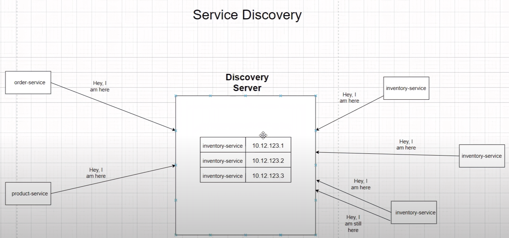
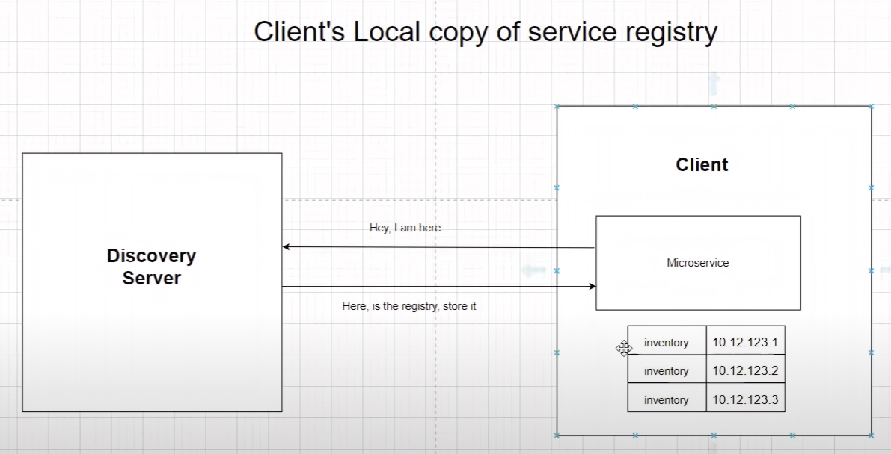

# Spring Boot Microservices
In this project I built a simplified architecture of a BID/ASK Pricing Match Engine

# Topics Covered
- Spring Cloud
- Service Discovery
- Centralized Configuration
- Distributed Tracing
- Event Driven Architecture
- Centralized Logging
- Circuit Breaker
- Unit testing with https://testcontainers.com/

TODO : Secure endpoint with keycloak

## How to run the application using Docker

1. Run `mvn clean package -DskipTests` to build the applications and create the docker image locally.
2. Run `docker-compose up -d` to start the applications.

## How to run the application without Docker

1. Run `mvn clean verify -DskipTests` by going inside each folder to build the applications.
2. After that run `mvn spring-boot:run` by going inside each folder to start the applications.

## Architecture

## Service discovery using Netflix Eureka

Whenever the apps start, they will register their presence on the discovery server.
The discovery server will build a table that maps the app -> IP:PORT

Whenever an app wants to make an http call to another app, 
it will ask the discovery server for the address.

Every client will keep a local copy of the address table in case the discovery server goes down.
Also, if in the address table we have many instances of an application,
and we fail to call one instance, the client will automatically try the next available instance.
This is useful for fault tolerance and load distribution.
