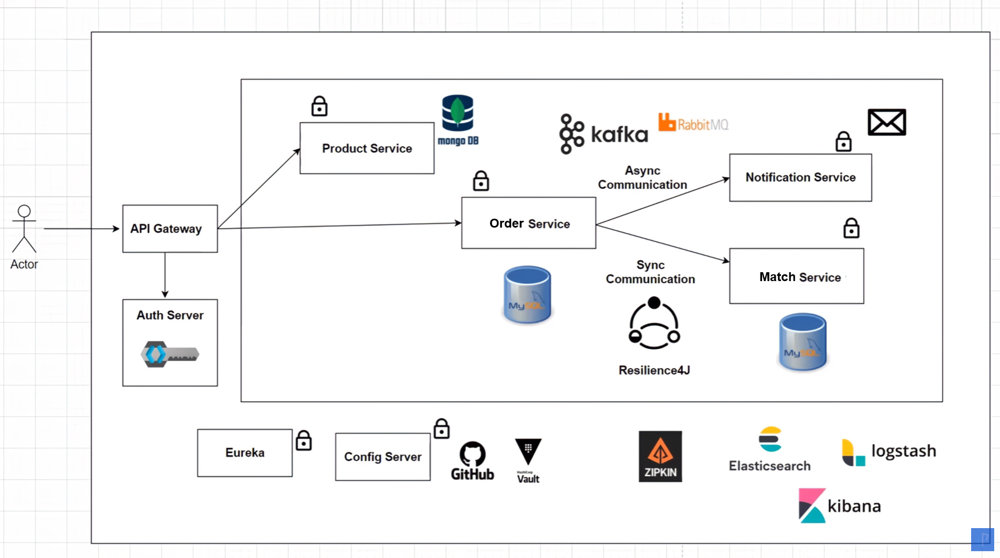

# Spring Boot Microservices
Simple Pricing Application

# Topics Covered
Spring Cloud
Service Discovery
Centralized Configuration
Distributed Tracing
Event Driven Architecture
Centralized Logging
Circuit Breaker
Unit testing with https://testcontainers.com/

TODO : Secure endpoint with keycloak

## How to run the application using Docker

1. Run `mvn clean package -DskipTests` to build the applications and create the docker image locally.
2. Run `docker-compose up -d` to start the applications.

## How to run the application without Docker

1. Run `mvn clean verify -DskipTests` by going inside each folder to build the applications.
2. After that run `mvn spring-boot:run` by going inside each folder to start the applications.

## Architecture
